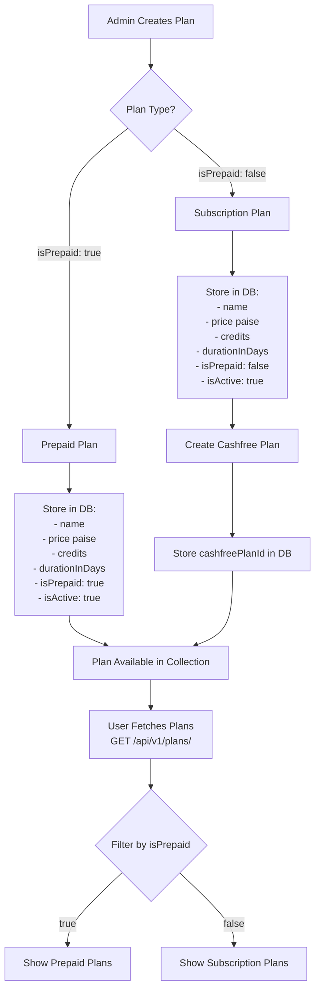
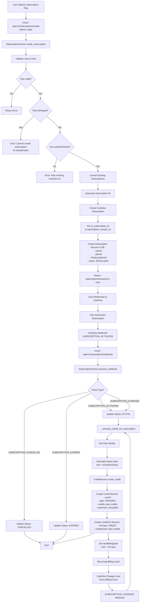
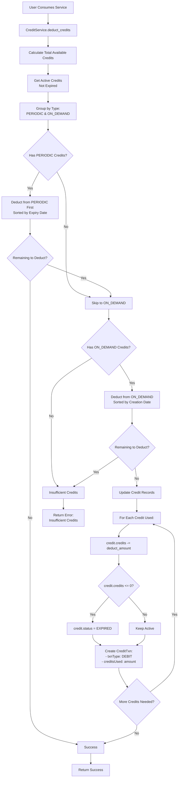
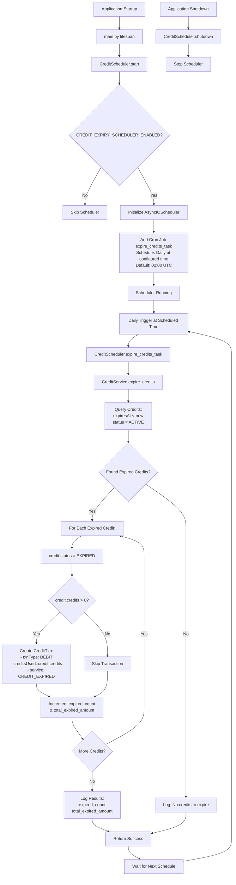
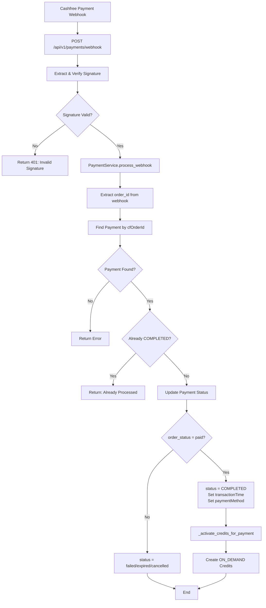
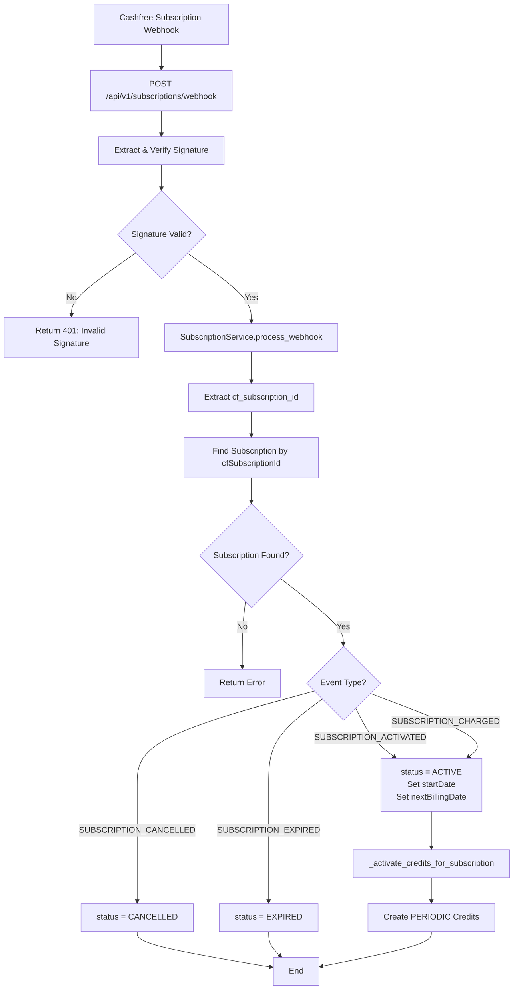

# Payment System Flow Diagram

This document provides a complete flowchart of how the payment system works in the codebase, including both prepaid and subscription processes, plan management, and schedulers.

## Table of Contents
1. [Plan Management Flow](#plan-management-flow)
2. [Prepaid Payment Flow](#prepaid-payment-flow)
3. [Subscription Payment Flow](#subscription-payment-flow)
4. [Credit Management Flow](#credit-management-flow)
5. [Scheduler Flow](#scheduler-flow)
6. [Webhook Processing](#webhook-processing)

---

## Plan Management Flow

Plans are stored in the database and can be either **Prepaid** (`isPrepaid: true`) or **Subscription** (`isPrepaid: false`).



**Key Points:**
- Plans are stored in MongoDB `plans` collection
- Prepaid plans don't need Cashfree plan ID
- Subscription plans require Cashfree plan creation and `cashfreePlanId`
- Plans can be fetched via `GET /api/v1/plans/` endpoint
- Only active plans (`isActive: true`) are shown by default

---

## Prepaid Payment Flow

Prepaid payments are one-time purchases that immediately grant credits.

```mermaid
flowchart TD
    A[User Selects Prepaid Plan] --> B[POST /api/v1/payments/create<br/>planId, origin]
    B --> C[PaymentService.create_payment]

    C --> D[Validate User & Plan]
    D --> E{Plan Valid?}
    E -->|No| F[Return Error]
    E -->|Yes| G[Generate Order ID]

    G --> H[Create Cashfree Payment Order]
    H --> I[Get payment_session_id]

    I --> J[Create Payment Record in DB:<br/>- userId<br/>- planId<br/>- cfOrderId<br/>- cfPaymentId<br/>- amount<br/>- status: PENDING]

    J --> K[Return paymentSessionId to User]
    K --> L[User Redirected to Cashfree]

    L --> M{Payment Status?}
    M -->|Success| N[Cashfree Webhook<br/>POST /api/v1/payments/webhook]
    M -->|User Returns| O[GET /api/v1/payments/verify/{order_id}]

    N --> P[PaymentService.process_webhook]
    O --> Q[PaymentService.verify_payment]

    P --> R{Status = COMPLETED?}
    Q --> R

    R -->|Yes| S[_activate_credits_for_payment]
    R -->|No| T[Update Payment Status Only]

    S --> U[Get Plan Details]
    U --> V[Calculate Expiry Date<br/>now + durationInDays]
    V --> W[CreditService.create_credit]
    W --> X[Create Credit Record:<br/>- userId<br/>- type: ON_DEMAND<br/>- credits: plan.credits<br/>- expiresAt: calculated]
    X --> Y[Create CreditTxn Record:<br/>- txnType: CREDIT<br/>- creditsUsed: plan.credits]

    T --> Z[End]
    Y --> Z
```

**Key Points:**
- Prepaid payments create `ON_DEMAND` type credits
- Credits expire based on `plan.durationInDays`
- Payment status tracked in `payments` collection
- Credits activated immediately upon successful payment
- Transaction records created for audit trail

---

## Subscription Payment Flow

Subscriptions are recurring payments that grant periodic credits.



**Key Points:**
- Subscriptions create `PERIODIC` type credits
- First charge happens 2 days after subscription creation
- Credits are renewed on each billing cycle (monthly)
- Subscription can be cancelled via `POST /api/v1/subscriptions/{id}/cancel`
- Status transitions: INITIALIZED → ACTIVE → (CANCELLED/EXPIRED)

---

## Credit Management Flow

Credits are deducted when users consume services, following FIFO logic.



**Key Points:**
- **FIFO Logic**: PERIODIC credits are deducted first (by expiry), then ON_DEMAND (by creation)
- Each deduction creates a transaction record
- Credits are marked as EXPIRED when balance reaches 0
- Transaction records track all credit movements

---

## Scheduler Flow

A background scheduler runs daily to expire credits that have passed their expiry date.



**Key Points:**
- Scheduler runs daily at configured time (default: 02:00 UTC)
- Can be disabled via `CREDIT_EXPIRY_SCHEDULER_ENABLED` env var
- Expires credits that have passed their `expiresAt` date
- Creates transaction records for expired credits
- Logs summary of expired credits

---

## Webhook Processing

Both payment and subscription webhooks are processed asynchronously.

### Payment Webhook Flow



### Subscription Webhook Flow



---

## Database Schema Overview

### Plans Collection
```javascript
{
  _id: ObjectId,
  name: String,
  cashfreePlanId: String | null,  // Required for subscriptions
  price: Integer,                  // In paise
  credits: Integer,
  durationInDays: Integer,
  isPrepaid: Boolean,               // true = Prepaid, false = Subscription
  isActive: Boolean,
  discount: Integer,                // In paise
  createdAt: DateTime,
  updatedAt: DateTime
}
```

### Payments Collection
```javascript
{
  _id: ObjectId,
  userId: ObjectId,
  planId: ObjectId | null,
  subscriptionId: ObjectId | null,
  cfPaymentId: String,
  cfOrderId: String,
  amount: Float,                    // In rupees
  status: String,                   // pending, completed, failed, cancelled, expired
  paymentMethod: String | null,
  transactionTime: DateTime | null,
  createdAt: DateTime,
  updatedAt: DateTime
}
```

### Subscriptions Collection
```javascript
{
  _id: ObjectId,
  userId: ObjectId,
  planId: ObjectId,
  cfSubscriptionId: String | null,
  status: String,                  // initialized, pending, active, cancelled, expired
  startDate: DateTime | null,
  nextBillingDate: DateTime | null,
  createdAt: DateTime,
  updatedAt: DateTime
}
```

### Credits Collection
```javascript
{
  _id: ObjectId,
  userId: ObjectId,
  type: String,                     // ON_DEMAND or PERIODIC
  credits: Integer,
  status: String,                  // ACTIVE or EXPIRED
  expiresAt: DateTime | null,
  createdAt: DateTime,
  updatedAt: DateTime
}
```

### Credit Transactions Collection
```javascript
{
  _id: ObjectId,
  userId: ObjectId,
  creditsId: ObjectId,
  txnType: String,                  // CREDIT or DEBIT
  creditsUsed: Integer,
  service: String | null,          // Service that triggered transaction
  createdAt: DateTime,
  updatedAt: DateTime
}
```

---

## Summary

### Prepaid Flow Summary
1. **Plan Selection**: User selects prepaid plan from collection
2. **Payment Creation**: Create Cashfree payment order
3. **Payment Processing**: User completes payment on Cashfree
4. **Webhook/Verification**: Payment status confirmed
5. **Credit Activation**: ON_DEMAND credits created immediately
6. **Expiration**: Credits expire based on `durationInDays` (handled by scheduler)

### Subscription Flow Summary
1. **Plan Selection**: User selects subscription plan from collection
2. **Subscription Creation**: Create Cashfree subscription
3. **Authorization**: User authorizes subscription on Cashfree
4. **Activation**: Subscription activated via webhook
5. **Credit Activation**: PERIODIC credits created on activation
6. **Recurring Billing**: Cashfree charges user monthly
7. **Credit Renewal**: New credits added on each charge (via webhook)
8. **Cancellation**: User can cancel subscription anytime

### Key Differences

| Aspect | Prepaid | Subscription |
|--------|---------|--------------|
| **Credit Type** | ON_DEMAND | PERIODIC |
| **Payment Frequency** | One-time | Recurring (monthly) |
| **Cashfree Plan ID** | Not required | Required |
| **Credit Expiry** | Based on plan duration | Based on plan duration (renewed each cycle) |
| **Deduction Priority** | Second priority (after PERIODIC) | First priority (before ON_DEMAND) |
| **Webhook Events** | Payment status updates | Subscription lifecycle events |

---

## API Endpoints Reference

### Plans
- `GET /api/v1/plans/` - List all plans
- `GET /api/v1/plans/{plan_id}` - Get plan details
- `POST /api/v1/plans/` - Create plan (admin)
- `PUT /api/v1/plans/{plan_id}` - Update plan (admin)

### Payments (Prepaid)
- `POST /api/v1/payments/create` - Create payment order
- `POST /api/v1/payments/verify/{order_id}` - Verify payment status
- `GET /api/payments/redirect/{order_id}` - Payment redirect page
- `POST /api/v1/payments/webhook` - Cashfree payment webhook

### Subscriptions
- `POST /api/v1/subscriptions/create` - Create subscription
- `GET /api/v1/subscriptions/me` - Get user subscriptions
- `POST /api/v1/subscriptions/{id}/cancel` - Cancel subscription
- `GET /api/subscriptions/redirect/{id}` - Subscription redirect page
- `POST /api/v1/subscriptions/webhook` - Cashfree subscription webhook

### Credits
- `GET /api/v1/credits/balance` - Get credit balance
- `GET /api/v1/credits/transactions` - Get transaction history

---

## Configuration

### Environment Variables
- `CREDIT_EXPIRY_SCHEDULER_ENABLED` - Enable/disable credit expiry scheduler (default: true)
- `CREDIT_EXPIRY_SCHEDULE_HOUR` - Hour for daily credit expiry (default: 2)
- `CREDIT_EXPIRY_SCHEDULE_MINUTE` - Minute for daily credit expiry (default: 0)
- `CASHFREE_APP_ID` - Cashfree application ID
- `CASHFREE_SECRET_KEY` - Cashfree secret key
- `CASHFREE_WEBHOOK_SECRET` - Webhook signature verification secret

---

*Last Updated: Based on codebase analysis*
